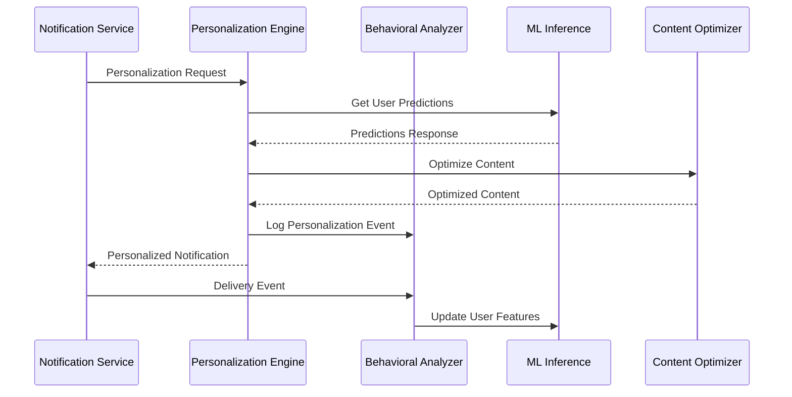

# Notification Personalization System - Design Specification

## Document Information

**Document Version:** 1.0  
**Last Updated:** January 2024  
**Document Owner:** Engineering Architecture Team  
**Stakeholders:** Engineering, Data Science, Product, DevOps  

---

## Executive Summary

The Notification Personalization System is designed as a sophisticated, AI-driven microservices architecture that delivers highly personalized, contextually relevant notifications across all channels. The system leverages advanced machine learning algorithms, real-time behavioral analysis, and comprehensive user profiling to optimize engagement, reduce notification fatigue, and maximize conversion rates.

This design emphasizes scalability, real-time processing, privacy compliance, and seamless integration with existing notification infrastructure while providing the flexibility to adapt to evolving personalization requirements.

---

## Architecture Overview

### Core Design Principles

1. **AI-First Architecture:** Machine learning and artificial intelligence at the core of all personalization decisions
2. **Real-Time Intelligence:** Sub-second personalization decisions based on current user context and behavior
3. **Privacy by Design:** Built-in privacy protection and compliance with global data protection regulations
4. **Scalable Processing:** Horizontal scaling to handle millions of users and billions of events
5. **Cross-Channel Orchestration:** Unified personalization across all notification channels
6. **Continuous Learning:** Self-improving system that learns from user interactions and feedback
7. **Contextual Awareness:** Deep understanding of user context, preferences, and current state
8. **Extensible Framework:** Modular design that supports new personalization strategies and channels

### High-Level Architecture

```mermaid
graph TB
    subgraph "Client Applications"
        WEB[Web Application]
        MOBILE[Mobile Apps]
        API_CLIENTS[API Clients]
    end

    subgraph "API Gateway Layer"
        GATEWAY[API Gateway]
        AUTH[Authentication Service]
        RATE_LIMIT[Rate Limiting]
    end

    subgraph "Personalization Core Services"
        PROFILE_ENGINE[Profile Engine]
        PERSONALIZATION_ENGINE[Personalization Engine]
        ML_INFERENCE[ML Inference Service]
        CONTENT_OPTIMIZER[Content Optimizer]
        TIMING_OPTIMIZER[Timing Optimizer]
        CHANNEL_OPTIMIZER[Channel Optimizer]
    end

    subgraph "Intelligence Services"
        BEHAVIORAL_ANALYZER[Behavioral Analyzer]
        PATTERN_RECOGNITION[Pattern Recognition]
        PREDICTIVE_MODELING[Predictive Modeling]
        SEGMENTATION_ENGINE[Segmentation Engine]
        CONTEXT_ANALYZER[Context Analyzer]
        FATIGUE_DETECTOR[Fatigue Detector]
    end

    subgraph "Data Processing Layer"
        EVENT_PROCESSOR[Event Processor]
        FEATURE_STORE[Feature Store]
        REAL_TIME_ANALYTICS[Real-time Analytics]
        BATCH_PROCESSOR[Batch Processor]
        DATA_PIPELINE[Data Pipeline]
    end

    subgraph "ML/AI Platform"
        MODEL_TRAINING[Model Training]
        MODEL_SERVING[Model Serving]
        EXPERIMENT_PLATFORM[Experiment Platform]
        AUTOML[AutoML Service]
        MODEL_REGISTRY[Model Registry]
    end

    subgraph "Data Storage"
        USER_PROFILES[(User Profiles DB)]
        BEHAVIORAL_DATA[(Behavioral Data)]
        FEATURE_CACHE[(Feature Cache)]
        MODEL_STORE[(Model Store)]
        ANALYTICS_DB[(Analytics DB)]
        AUDIT_LOG[(Audit Log)]
    end

    subgraph "External Integrations"
        NOTIFICATION_SERVICES[Notification Services]
        CRM_SYSTEMS[CRM Systems]
        ANALYTICS_PLATFORMS[Analytics Platforms]
        CONTENT_MANAGEMENT[Content Management]
        EXTERNAL_DATA[External Data Sources]
    end

    subgraph "Infrastructure Services"
        MESSAGE_QUEUE[Message Queue]
        CACHE_LAYER[Cache Layer]
        MONITORING[Monitoring]
        LOGGING[Logging]
        SECURITY[Security Services]
    end

    WEB --> GATEWAY
    MOBILE --> GATEWAY
    API_CLIENTS --> GATEWAY

    GATEWAY --> AUTH
    GATEWAY --> RATE_LIMIT
    GATEWAY --> PROFILE_ENGINE

    PROFILE_ENGINE --> PERSONALIZATION_ENGINE
    PERSONALIZATION_ENGINE --> ML_INFERENCE
    PERSONALIZATION_ENGINE --> CONTENT_OPTIMIZER
    PERSONALIZATION_ENGINE --> TIMING_OPTIMIZER
    PERSONALIZATION_ENGINE --> CHANNEL_OPTIMIZER

    ML_INFERENCE --> BEHAVIORAL_ANALYZER
    ML_INFERENCE --> PATTERN_RECOGNITION
    ML_INFERENCE --> PREDICTIVE_MODELING
    ML_INFERENCE --> SEGMENTATION_ENGINE
    ML_INFERENCE --> CONTEXT_ANALYZER
    ML_INFERENCE --> FATIGUE_DETECTOR

    BEHAVIORAL_ANALYZER --> EVENT_PROCESSOR
    EVENT_PROCESSOR --> FEATURE_STORE
    EVENT_PROCESSOR --> REAL_TIME_ANALYTICS
    EVENT_PROCESSOR --> BATCH_PROCESSOR
    BATCH_PROCESSOR --> DATA_PIPELINE

    MODEL_TRAINING --> MODEL_SERVING
    MODEL_SERVING --> MODEL_REGISTRY
    EXPERIMENT_PLATFORM --> AUTOML

    PERSONALIZATION_ENGINE --> USER_PROFILES
    BEHAVIORAL_ANALYZER --> BEHAVIORAL_DATA
    ML_INFERENCE --> FEATURE_CACHE
    MODEL_SERVING --> MODEL_STORE
    REAL_TIME_ANALYTICS --> ANALYTICS_DB

    PERSONALIZATION_ENGINE --> NOTIFICATION_SERVICES
    PROFILE_ENGINE --> CRM_SYSTEMS
    REAL_TIME_ANALYTICS --> ANALYTICS_PLATFORMS
    CONTENT_OPTIMIZER --> CONTENT_MANAGEMENT
    EVENT_PROCESSOR --> EXTERNAL_DATA

    EVENT_PROCESSOR --> MESSAGE_QUEUE
    PERSONALIZATION_ENGINE --> CACHE_LAYER
    PROFILE_ENGINE --> MONITORING
    BEHAVIORAL_ANALYZER --> LOGGING
    AUTH --> SECURITY
```



---

## Core Services Architecture

### 1. Profile Engine Service

**Purpose:** Manages comprehensive user profiles and real-time profile updates  
**Technology:** Node.js with TypeScript, PostgreSQL, Redis  
**Scaling:** Horizontal with database sharding  

#### Key Responsibilities
- User profile creation, updates, and retrieval
- Real-time profile synchronization across services
- Profile data validation and integrity checks
- Privacy-compliant profile management
- Profile versioning and history tracking
- Cross-channel profile consistency
- Profile analytics and insights

#### Service Interface
```typescript
interface ProfileEngineService {
  // Profile Management
  createProfile(userId: string, profileData: UserProfile): Promise<UserProfile>;
  updateProfile(userId: string, updates: Partial<UserProfile>): Promise<UserProfile>;
  getProfile(userId: string): Promise<UserProfile>;
  deleteProfile(userId: string): Promise<void>;
  
  // Real-time Updates
  subscribeToProfileUpdates(userId: string, callback: ProfileUpdateCallback): void;
  publishProfileUpdate(userId: string, update: ProfileUpdate): Promise<void>;
  
  // Profile Analytics
  getProfileInsights(userId: string): Promise<ProfileInsights>;
  getProfileSegments(userId: string): Promise<UserSegment[]>;
  
  // Privacy and Compliance
  exportProfileData(userId: string): Promise<ProfileExport>;
  anonymizeProfile(userId: string): Promise<void>;
  getConsentStatus(userId: string): Promise<ConsentStatus>;
}
```

### 2. Personalization Engine Service

**Purpose:** Core personalization orchestration and decision-making service  
**Technology:** Python with FastAPI, TensorFlow, Redis  
**Scaling:** Horizontal with load balancing  

#### Key Responsibilities
- Orchestrate personalization across all channels
- Make real-time personalization decisions
- Coordinate with ML inference services
- Manage personalization strategies and rules
- A/B testing and experimentation
- Performance monitoring and optimization
- Cross-channel consistency management

#### Service Interface
```python
class PersonalizationEngineService:
    # Core Personalization
    async def personalize_notification(
        self, 
        user_id: str, 
        notification_type: str, 
        context: PersonalizationContext
    ) -> PersonalizedNotification:
        pass
    
    async def get_personalization_strategy(
        self, 
        user_id: str, 
        channel: NotificationChannel
    ) -> PersonalizationStrategy:
        pass
    
    # Cross-Channel Orchestration
    async def orchestrate_cross_channel(
        self, 
        user_id: str, 
        campaign_id: str
    ) -> CrossChannelPlan:
        pass
    
    # Experimentation
    async def run_ab_test(
        self, 
        test_config: ABTestConfig, 
        user_id: str
    ) -> ABTestResult:
        pass
    
    # Analytics and Insights
    async def get_personalization_insights(
        self, 
        user_id: str, 
        time_range: TimeRange
    ) -> PersonalizationInsights:
        pass
```

### 3. ML Inference Service

**Purpose:** Real-time machine learning model inference for personalization decisions  
**Technology:** Python with TensorFlow Serving, MLflow, Kubernetes  
**Scaling:** Auto-scaling based on inference load  

#### Key Responsibilities
- Real-time ML model inference
- Model version management and A/B testing
- Feature engineering and transformation
- Model performance monitoring
- Batch inference for large-scale processing
- Model explainability and interpretability
- Inference caching and optimization

#### Service Interface
```python
class MLInferenceService:
    # Model Inference
    async def predict_engagement(
        self, 
        user_features: UserFeatures, 
        content_features: ContentFeatures
    ) -> EngagementPrediction:
        pass
    
    async def predict_optimal_timing(
        self, 
        user_id: str, 
        notification_type: str
    ) -> OptimalTiming:
        pass
    
    async def predict_channel_preference(
        self, 
        user_id: str, 
        context: UserContext
    ) -> ChannelPreference:
        pass
    
    # Batch Processing
    async def batch_inference(
        self, 
        inference_request: BatchInferenceRequest
    ) -> BatchInferenceResult:
        pass
    
    # Model Management
    async def deploy_model(
        self, 
        model_config: ModelConfig
    ) -> ModelDeployment:
        pass
    
    async def get_model_performance(
        self, 
        model_id: str
    ) -> ModelPerformance:
        pass
```

### 4. Behavioral Analyzer Service

**Purpose:** Analyzes user behavior patterns and generates behavioral insights  
**Technology:** Python with Apache Spark, Kafka Streams, Elasticsearch  
**Scaling:** Horizontal with stream processing  

#### Key Responsibilities
- Real-time behavioral event processing
- Behavioral pattern recognition and analysis
- User journey tracking and analysis
- Engagement scoring and classification
- Anomaly detection in user behavior
- Behavioral segmentation
- Predictive behavioral modeling

#### Service Interface
```python
class BehavioralAnalyzerService:
    # Event Processing
    async def process_behavioral_event(
        self, 
        event: BehavioralEvent
    ) -> ProcessingResult:
        pass
    
    # Pattern Recognition
    async def analyze_user_patterns(
        self, 
        user_id: str, 
        time_window: TimeWindow
    ) -> BehavioralPatterns:
        pass
    
    # Engagement Analysis
    async def calculate_engagement_score(
        self, 
        user_id: str
    ) -> EngagementScore:
        pass
    
    # Journey Analysis
    async def analyze_user_journey(
        self, 
        user_id: str, 
        journey_config: JourneyConfig
    ) -> UserJourney:
        pass
    
    # Segmentation
    async def get_behavioral_segments(
        self, 
        user_id: str
    ) -> List[BehavioralSegment]:
        pass
```

### 5. Content Optimizer Service

**Purpose:** Optimizes notification content for maximum engagement and relevance  
**Technology:** Python with NLP libraries, TensorFlow, Redis  
**Scaling:** Horizontal with content caching  

#### Key Responsibilities
- Dynamic content generation and optimization
- A/B testing of content variations
- Content personalization based on user preferences
- Multi-language content optimization
- Content performance analytics
- Brand consistency enforcement
- Content recommendation and suggestion

#### Service Interface
```python
class ContentOptimizerService:
    # Content Generation
    async def generate_personalized_content(
        self, 
        user_id: str, 
        content_template: ContentTemplate, 
        context: ContentContext
    ) -> PersonalizedContent:
        pass
    
    # Content Optimization
    async def optimize_subject_line(
        self, 
        user_id: str, 
        base_subject: str
    ) -> OptimizedSubject:
        pass
    
    async def optimize_call_to_action(
        self, 
        user_id: str, 
        cta_context: CTAContext
    ) -> OptimizedCTA:
        pass
    
    # Content Testing
    async def run_content_ab_test(
        self, 
        test_config: ContentABTest
    ) -> ContentTestResult:
        pass
    
    # Content Analytics
    async def get_content_performance(
        self, 
        content_id: str, 
        metrics: List[str]
    ) -> ContentPerformance:
        pass
```

### 6. Timing Optimizer Service

**Purpose:** Optimizes notification timing for maximum user engagement  
**Technology:** Python with time series analysis, scikit-learn, Redis  
**Scaling:** Horizontal with timezone-aware processing  

#### Key Responsibilities
- Optimal send time prediction
- Timezone-aware timing optimization
- Frequency management and fatigue prevention
- Seasonal and temporal pattern analysis
- Emergency notification handling
- Cross-channel timing coordination
- Timing performance analytics

#### Service Interface
```python
class TimingOptimizerService:
    # Timing Optimization
    async def get_optimal_send_time(
        self, 
        user_id: str, 
        notification_type: str, 
        urgency: UrgencyLevel
    ) -> OptimalSendTime:
        pass
    
    # Frequency Management
    async def check_frequency_limits(
        self, 
        user_id: str, 
        channel: NotificationChannel
    ) -> FrequencyCheck:
        pass
    
    async def update_frequency_cap(
        self, 
        user_id: str, 
        channel: NotificationChannel, 
        sent_notification: SentNotification
    ) -> None:
        pass
    
    # Fatigue Detection
    async def detect_notification_fatigue(
        self, 
        user_id: str
    ) -> FatigueAssessment:
        pass
    
    # Cross-Channel Coordination
    async def coordinate_cross_channel_timing(
        self, 
        user_id: str, 
        campaign_id: str
    ) -> TimingCoordination:
        pass
```

### 7. Channel Optimizer Service

**Purpose:** Optimizes notification channel selection and channel-specific formatting  
**Technology:** Node.js with TypeScript, Redis, PostgreSQL  
**Scaling:** Horizontal with channel-specific optimization  

#### Key Responsibilities
- Channel preference prediction and optimization
- Channel-specific content formatting
- Cross-channel consistency management
- Channel performance analytics
- Fallback channel management
- Channel capacity and rate limiting
- Multi-channel journey orchestration

#### Service Interface
```typescript
interface ChannelOptimizerService {
  // Channel Selection
  getOptimalChannel(
    userId: string, 
    notificationType: string, 
    context: ChannelContext
  ): Promise<OptimalChannel>;
  
  // Channel Formatting
  formatForChannel(
    content: NotificationContent, 
    channel: NotificationChannel, 
    userPreferences: UserPreferences
  ): Promise<FormattedContent>;
  
  // Cross-Channel Management
  orchestrateMultiChannel(
    userId: string, 
    campaignId: string, 
    channels: NotificationChannel[]
  ): Promise<MultiChannelPlan>;
  
  // Channel Analytics
  getChannelPerformance(
    userId: string, 
    channel: NotificationChannel, 
    timeRange: TimeRange
  ): Promise<ChannelPerformance>;
  
  // Fallback Management
  getFallbackChannels(
    userId: string, 
    primaryChannel: NotificationChannel
  ): Promise<NotificationChannel[]>;
}
```

---

## Data Models and Schema

### Core Data Models

#### User Profile Model
```typescript
interface UserProfile {
  userId: string;
  demographics: {
    age?: number;
    location: {
      country: string;
      region: string;
      city: string;
      timezone: string;
    };
    jobRole?: string;
    industry?: string;
    experienceLevel?: ExperienceLevel;
    skills: string[];
  };
  preferences: {
    channels: ChannelPreferences;
    content: ContentPreferences;
    timing: TimingPreferences;
    frequency: FrequencyPreferences;
    language: string;
    locale: string;
  };
  behavior: {
    engagementScore: number;
    activityPatterns: ActivityPattern[];
    channelUsage: ChannelUsageStats;
    contentInteractions: ContentInteraction[];
    lastActive: Date;
    sessionFrequency: number;
  };
  personalization: {
    segments: UserSegment[];
    predictions: PersonalizationPredictions;
    experiments: ActiveExperiment[];
    customAttributes: Record<string, any>;
  };
  privacy: {
    consentStatus: ConsentStatus;
    dataRetention: DataRetentionSettings;
    optOuts: OptOutSettings;
    lastConsentUpdate: Date;
  };
  metadata: {
    createdAt: Date;
    updatedAt: Date;
    version: number;
    source: string;
  };
}
```

#### Personalization Context Model
```typescript
interface PersonalizationContext {
  user: {
    userId: string;
    currentLocation?: Location;
    currentDevice: DeviceInfo;
    currentSession: SessionInfo;
    recentActivity: RecentActivity[];
  };
  notification: {
    type: NotificationTypeEnum;
    priority: PriorityLevel;
    category: NotificationCategory;
    urgency: UrgencyLevel;
    expiresAt?: Date;
  };
  content: {
    templateId: string;
    variables: Record<string, any>;
    language: string;
    locale: string;
  };
  campaign: {
    campaignId?: string;
    journeyId?: string;
    stepId?: string;
    experimentId?: string;
  };
  external: {
    marketConditions?: MarketConditions;
    weatherData?: WeatherData;
    eventData?: EventData;
    socialContext?: SocialContext;
  };
  constraints: {
    deliveryWindow?: TimeWindow;
    channelRestrictions?: NotificationChannel[];
    frequencyLimits?: FrequencyLimits;
    complianceRequirements?: ComplianceRequirement[];
  };
}
```

#### Behavioral Event Model
```typescript
interface BehavioralEvent {
  eventId: string;
  userId: string;
  eventType: BehavioralEventType;
  timestamp: Date;
  channel: NotificationChannel;
  properties: {
    notificationId?: string;
    campaignId?: string;
    contentId?: string;
    action: ActionType;
    duration?: number;
    value?: number;
    metadata: Record<string, any>;
  };
  context: {
    device: DeviceInfo;
    location?: Location;
    session: SessionInfo;
    referrer?: string;
    userAgent?: string;
  };
  attribution: {
    source: string;
    medium: string;
    campaign?: string;
    touchpoint: string;
  };
}
```

#### Personalization Strategy Model
```typescript
interface PersonalizationStrategy {
  strategyId: string;
  userId: string;
  channel: NotificationChannel;
  strategy: {
    contentPersonalization: ContentPersonalizationConfig;
    timingOptimization: TimingOptimizationConfig;
    frequencyManagement: FrequencyManagementConfig;
    channelSelection: ChannelSelectionConfig;
  };
  performance: {
    engagementRate: number;
    conversionRate: number;
    satisfactionScore: number;
    fatigueScore: number;
    lastUpdated: Date;
  };
  experiments: {
    activeTests: ActiveExperiment[];
    completedTests: CompletedExperiment[];
    testResults: ExperimentResult[];
  };
  metadata: {
    createdAt: Date;
    updatedAt: Date;
    version: number;
    confidence: number;
  };
}
```

### Database Schema Design

#### PostgreSQL Schema for Core Data

```sql
-- User Profiles Table
CREATE TABLE user_profiles (
    user_id UUID PRIMARY KEY,
    demographics JSONB NOT NULL DEFAULT '{}',
    preferences JSONB NOT NULL DEFAULT '{}',
    behavior JSONB NOT NULL DEFAULT '{}',
    personalization JSONB NOT NULL DEFAULT '{}',
    privacy JSONB NOT NULL DEFAULT '{}',
    metadata JSONB NOT NULL DEFAULT '{}',
    created_at TIMESTAMP WITH TIME ZONE DEFAULT NOW(),
    updated_at TIMESTAMP WITH TIME ZONE DEFAULT NOW(),
    version INTEGER DEFAULT 1
);

-- Behavioral Events Table (Partitioned by date)
CREATE TABLE behavioral_events (
    event_id UUID PRIMARY KEY,
    user_id UUID NOT NULL,
    event_type VARCHAR(50) NOT NULL,
    timestamp TIMESTAMP WITH TIME ZONE NOT NULL,
    channel VARCHAR(20) NOT NULL,
    properties JSONB NOT NULL DEFAULT '{}',
    context JSONB NOT NULL DEFAULT '{}',
    attribution JSONB NOT NULL DEFAULT '{}'
) PARTITION BY RANGE (timestamp);

-- Personalization Strategies Table
CREATE TABLE personalization_strategies (
    strategy_id UUID PRIMARY KEY,
    user_id UUID NOT NULL,
    channel VARCHAR(20) NOT NULL,
    strategy JSONB NOT NULL DEFAULT '{}',
    performance JSONB NOT NULL DEFAULT '{}',
    experiments JSONB NOT NULL DEFAULT '{}',
    metadata JSONB NOT NULL DEFAULT '{}',
    created_at TIMESTAMP WITH TIME ZONE DEFAULT NOW(),
    updated_at TIMESTAMP WITH TIME ZONE DEFAULT NOW(),
    UNIQUE(user_id, channel)
);

-- User Segments Table
CREATE TABLE user_segments (
    segment_id UUID PRIMARY KEY,
    segment_name VARCHAR(100) NOT NULL,
    segment_type VARCHAR(50) NOT NULL,
    criteria JSONB NOT NULL,
    metadata JSONB NOT NULL DEFAULT '{}',
    created_at TIMESTAMP WITH TIME ZONE DEFAULT NOW(),
    updated_at TIMESTAMP WITH TIME ZONE DEFAULT NOW()
);

-- User Segment Memberships Table
CREATE TABLE user_segment_memberships (
    user_id UUID NOT NULL,
    segment_id UUID NOT NULL,
    confidence_score DECIMAL(3,2) NOT NULL,
    assigned_at TIMESTAMP WITH TIME ZONE DEFAULT NOW(),
    expires_at TIMESTAMP WITH TIME ZONE,
    PRIMARY KEY (user_id, segment_id)
);

-- ML Model Registry Table
CREATE TABLE ml_models (
    model_id UUID PRIMARY KEY,
    model_name VARCHAR(100) NOT NULL,
    model_type VARCHAR(50) NOT NULL,
    version VARCHAR(20) NOT NULL,
    status VARCHAR(20) NOT NULL,
    configuration JSONB NOT NULL DEFAULT '{}',
    performance_metrics JSONB NOT NULL DEFAULT '{}',
    deployment_info JSONB NOT NULL DEFAULT '{}',
    created_at TIMESTAMP WITH TIME ZONE DEFAULT NOW(),
    deployed_at TIMESTAMP WITH TIME ZONE,
    UNIQUE(model_name, version)
);

-- Personalization Experiments Table
CREATE TABLE personalization_experiments (
    experiment_id UUID PRIMARY KEY,
    experiment_name VARCHAR(100) NOT NULL,
    experiment_type VARCHAR(50) NOT NULL,
    status VARCHAR(20) NOT NULL,
    configuration JSONB NOT NULL,
    results JSONB NOT NULL DEFAULT '{}',
    participants JSONB NOT NULL DEFAULT '{}',
    start_date TIMESTAMP WITH TIME ZONE NOT NULL,
    end_date TIMESTAMP WITH TIME ZONE,
    created_at TIMESTAMP WITH TIME ZONE DEFAULT NOW()
);

-- Feature Store Table
CREATE TABLE feature_store (
    feature_id UUID PRIMARY KEY,
    user_id UUID NOT NULL,
    feature_name VARCHAR(100) NOT NULL,
    feature_value JSONB NOT NULL,
    feature_type VARCHAR(50) NOT NULL,
    computed_at TIMESTAMP WITH TIME ZONE NOT NULL,
    expires_at TIMESTAMP WITH TIME ZONE,
    version INTEGER DEFAULT 1,
    UNIQUE(user_id, feature_name)
);

-- Indexes for Performance
CREATE INDEX idx_user_profiles_updated_at ON user_profiles(updated_at);
CREATE INDEX idx_behavioral_events_user_timestamp ON behavioral_events(user_id, timestamp);
CREATE INDEX idx_behavioral_events_type_timestamp ON behavioral_events(event_type, timestamp);
CREATE INDEX idx_personalization_strategies_user_channel ON personalization_strategies(user_id, channel);
CREATE INDEX idx_user_segment_memberships_user ON user_segment_memberships(user_id);
CREATE INDEX idx_user_segment_memberships_segment ON user_segment_memberships(segment_id);
CREATE INDEX idx_feature_store_user_name ON feature_store(user_id, feature_name);
CREATE INDEX idx_feature_store_expires_at ON feature_store(expires_at);

-- Custom Types
CREATE TYPE notification_channel AS ENUM ('email', 'sms', 'push', 'in_app', 'web', 'voice');
CREATE TYPE experience_level AS ENUM ('entry', 'junior', 'mid', 'senior', 'executive');
CREATE TYPE priority_level AS ENUM ('low', 'medium', 'high', 'urgent');
CREATE TYPE urgency_level AS ENUM ('immediate', 'within_hour', 'within_day', 'flexible');
CREATE TYPE behavioral_event_type AS ENUM (
    'notification_sent', 'notification_delivered', 'notification_opened', 
    'notification_clicked', 'notification_dismissed', 'notification_unsubscribed',
    'app_opened', 'app_closed', 'page_viewed', 'action_completed',
    'job_applied', 'job_saved', 'profile_updated', 'search_performed'
);
```

#### MongoDB Schema for Flexible Data

```javascript
// User Behavioral Patterns Collection
db.createCollection("user_behavioral_patterns", {
  validator: {
    $jsonSchema: {
      bsonType: "object",
      required: ["userId", "patterns", "updatedAt"],
      properties: {
        userId: { bsonType: "string" },
        patterns: {
          bsonType: "object",
          properties: {
            activityTimes: { bsonType: "array" },
            channelPreferences: { bsonType: "object" },
            contentInteractions: { bsonType: "array" },
            engagementCycles: { bsonType: "array" }
          }
        },
        predictions: {
          bsonType: "object",
          properties: {
            nextEngagement: { bsonType: "date" },
            churnRisk: { bsonType: "double" },
            lifetimeValue: { bsonType: "double" }
          }
        },
        updatedAt: { bsonType: "date" }
      }
    }
  }
});

// Real-time User Context Collection
db.createCollection("user_context", {
  validator: {
    $jsonSchema: {
      bsonType: "object",
      required: ["userId", "context", "timestamp"],
      properties: {
        userId: { bsonType: "string" },
        context: {
          bsonType: "object",
          properties: {
            location: { bsonType: "object" },
            device: { bsonType: "object" },
            session: { bsonType: "object" },
            activity: { bsonType: "object" }
          }
        },
        timestamp: { bsonType: "date" },
        expiresAt: { bsonType: "date" }
      }
    }
  }
});

// Create indexes
db.user_behavioral_patterns.createIndex({ "userId": 1 });
db.user_behavioral_patterns.createIndex({ "updatedAt": 1 });
db.user_context.createIndex({ "userId": 1 });
db.user_context.createIndex({ "expiresAt": 1 }, { expireAfterSeconds: 0 });
```

---

## Configuration Management

### Environment Configuration

```yaml
# config/production.yaml
personalization:
  engine:
    max_concurrent_requests: 10000
    request_timeout: 5000
    cache_ttl: 300
    batch_size: 1000
  
  ml_inference:
    model_serving_url: "http://ml-serving:8501"
    inference_timeout: 100
    max_batch_size: 100
    model_cache_size: 10
  
  behavioral_analysis:
    event_buffer_size: 10000
    processing_interval: 1000
    pattern_analysis_window: 86400
    anomaly_detection_threshold: 0.95
  
  content_optimization:
    generation_timeout: 200
    max_variations: 10
    ab_test_duration: 604800
    content_cache_ttl: 3600
  
  timing_optimization:
    prediction_window: 604800
    frequency_check_interval: 3600
    fatigue_threshold: 0.8
    timezone_cache_ttl: 86400
  
  channel_optimization:
    fallback_channels: ["email", "push"]
    channel_capacity_limits:
      email: 1000000
      sms: 100000
      push: 5000000
    rate_limiting:
      per_user_per_hour: 10
      per_channel_per_minute: 1000

database:
  postgresql:
    host: "postgres-cluster"
    port: 5432
    database: "personalization"
    pool_size: 20
    max_connections: 100
    connection_timeout: 5000
  
  mongodb:
    uri: "mongodb://mongo-cluster:27017/personalization"
    pool_size: 10
    max_connections: 50
  
  redis:
    cluster_nodes:
      - "redis-node-1:6379"
      - "redis-node-2:6379"
      - "redis-node-3:6379"
    pool_size: 20
    key_prefix: "personalization:"

messaging:
  kafka:
    brokers:
      - "kafka-1:9092"
      - "kafka-2:9092"
      - "kafka-3:9092"
    topics:
      behavioral_events: "behavioral-events"
      personalization_requests: "personalization-requests"
      ml_inference_requests: "ml-inference-requests"
    consumer_groups:
      behavioral_analyzer: "behavioral-analyzer-group"
      personalization_engine: "personalization-engine-group"

monitoring:
  prometheus:
    metrics_port: 9090
    scrape_interval: 15
  
  jaeger:
    agent_host: "jaeger-agent"
    agent_port: 6831
    sampler_rate: 0.1
  
  logging:
    level: "info"
    format: "json"
    output: "stdout"

security:
  encryption:
    algorithm: "AES-256-GCM"
    key_rotation_interval: 2592000
  
  authentication:
    jwt_secret: "${JWT_SECRET}"
    token_expiry: 3600
  
  rate_limiting:
    requests_per_minute: 1000
    burst_size: 100
```

---

## Integration Architecture

### Internal System Integration

#### Event-Driven Integration


#### API Integration Patterns
```typescript
// Notification Service Integration
interface NotificationServiceIntegration {
  // Inbound - Personalization Requests
  personalizeNotification(request: PersonalizationRequest): Promise<PersonalizedNotification>;
  
  // Outbound - Delivery Events
  onNotificationDelivered(event: DeliveryEvent): void;
  onNotificationEngaged(event: EngagementEvent): void;
  onNotificationFailed(event: FailureEvent): void;
}

// User Management Integration
interface UserManagementIntegration {
  // Inbound - Profile Updates
  onUserProfileUpdated(event: ProfileUpdateEvent): void;
  onUserPreferencesChanged(event: PreferencesChangeEvent): void;
  
  // Outbound - Profile Requests
  getUserProfile(userId: string): Promise<UserProfile>;
  updateUserPreferences(userId: string, preferences: UserPreferences): Promise<void>;
}

// Analytics Platform Integration
interface AnalyticsPlatformIntegration {
  // Outbound - Analytics Events
  trackPersonalizationEvent(event: PersonalizationAnalyticsEvent): void;
  trackEngagementMetrics(metrics: EngagementMetrics): void;
  trackExperimentResults(results: ExperimentResults): void;
}
```

### External System Integration

#### CRM Integration
```typescript
interface CRMIntegration {
  // Customer Data Synchronization
  syncCustomerData(customerId: string): Promise<CustomerData>;
  updateCustomerEngagement(customerId: string, engagement: EngagementData): Promise<void>;
  
  // Segmentation Sync
  syncCustomerSegments(customerId: string): Promise<CustomerSegment[]>;
  updateSegmentMembership(customerId: string, segments: CustomerSegment[]): Promise<void>;
}
```

#### Marketing Automation Integration
```typescript
interface MarketingAutomationIntegration {
  // Campaign Data
  getCampaignData(campaignId: string): Promise<CampaignData>;
  updateCampaignPerformance(campaignId: string, performance: CampaignPerformance): Promise<void>;
  
  // Journey Orchestration
  triggerJourneyStep(userId: string, journeyId: string, stepId: string): Promise<void>;
  getJourneyContext(userId: string, journeyId: string): Promise<JourneyContext>;
}
```

---

## Error Handling and Resilience

### Error Handling Strategy

#### Centralized Error Management
```typescript
class PersonalizationErrorHandler {
  private static instance: PersonalizationErrorHandler;
  private errorCategories: Map<string, ErrorCategory>;
  private retryPolicies: Map<string, RetryPolicy>;
  private circuitBreakers: Map<string, CircuitBreaker>;

  // Error Classification
  classifyError(error: Error, context: ErrorContext): ErrorClassification {
    // Classify errors by type, severity, and recovery strategy
    return {
      category: this.determineCategory(error),
      severity: this.determineSeverity(error, context),
      recoverable: this.isRecoverable(error),
      retryable: this.isRetryable(error),
      fallbackAvailable: this.hasFallback(error, context)
    };
  }

  // Error Recovery
  async handleError(error: Error, context: ErrorContext): Promise<ErrorHandlingResult> {
    const classification = this.classifyError(error, context);
    
    switch (classification.category) {
      case ErrorCategory.ML_INFERENCE_FAILURE:
        return this.handleMLInferenceFailure(error, context);
      case ErrorCategory.DATA_ACCESS_FAILURE:
        return this.handleDataAccessFailure(error, context);
      case ErrorCategory.EXTERNAL_SERVICE_FAILURE:
        return this.handleExternalServiceFailure(error, context);
      default:
        return this.handleGenericError(error, context);
    }
  }

  // Fallback Strategies
  private async handleMLInferenceFailure(error: Error, context: ErrorContext): Promise<ErrorHandlingResult> {
    // Fallback to rule-based personalization
    const fallbackPersonalization = await this.getRuleBasedPersonalization(context.userId);
    return {
      success: true,
      result: fallbackPersonalization,
      fallbackUsed: true,
      errorLogged: true
    };
  }
}
```

#### Circuit Breaker Implementation
```typescript
class CircuitBreaker {
  private state: CircuitBreakerState = CircuitBreakerState.CLOSED;
  private failureCount: number = 0;
  private lastFailureTime: Date | null = null;
  private successCount: number = 0;

  async execute<T>(operation: () => Promise<T>): Promise<T> {
    if (this.state === CircuitBreakerState.OPEN) {
      if (this.shouldAttemptReset()) {
        this.state = CircuitBreakerState.HALF_OPEN;
      } else {
        throw new CircuitBreakerOpenError('Circuit breaker is open');
      }
    }

    try {
      const result = await operation();
      this.onSuccess();
      return result;
    } catch (error) {
      this.onFailure();
      throw error;
    }
  }

  private onSuccess(): void {
    this.failureCount = 0;
    this.successCount++;
    
    if (this.state === CircuitBreakerState.HALF_OPEN) {
      if (this.successCount >= this.config.successThreshold) {
        this.state = CircuitBreakerState.CLOSED;
        this.successCount = 0;
      }
    }
  }

  private onFailure(): void {
    this.failureCount++;
    this.lastFailureTime = new Date();
    
    if (this.failureCount >= this.config.failureThreshold) {
      this.state = CircuitBreakerState.OPEN;
    }
  }
}
```

### Retry Mechanisms

#### Exponential Backoff Retry
```typescript
class RetryManager {
  async executeWithRetry<T>(
    operation: () => Promise<T>,
    retryPolicy: RetryPolicy
  ): Promise<T> {
    let lastError: Error;
    
    for (let attempt = 0; attempt <= retryPolicy.maxAttempts; attempt++) {
      try {
        return await operation();
      } catch (error) {
        lastError = error;
        
        if (attempt === retryPolicy.maxAttempts || !this.isRetryable(error)) {
          throw error;
        }
        
        const delay = this.calculateDelay(attempt, retryPolicy);
        await this.sleep(delay);
      }
    }
    
    throw lastError!;
  }

  private calculateDelay(attempt: number, policy: RetryPolicy): number {
    const baseDelay = policy.baseDelay;
    const maxDelay = policy.maxDelay;
    const backoffMultiplier = policy.backoffMultiplier;
    
    const delay = baseDelay * Math.pow(backoffMultiplier, attempt);
    return Math.min(delay, maxDelay);
  }
}
```

---

## Performance Optimization

### Caching Strategy

#### Multi-Level Caching Architecture
```typescript
class PersonalizationCacheManager {
  private l1Cache: MemoryCache; // In-memory cache
  private l2Cache: RedisCache;  // Distributed cache
  private l3Cache: DatabaseCache; // Database cache

  async get<T>(key: string, type: CacheType): Promise<T | null> {
    // L1 Cache (Memory)
    let result = await this.l1Cache.get<T>(key);
    if (result) {
      this.recordCacheHit('L1', key);
      return result;
    }

    // L2 Cache (Redis)
    result = await this.l2Cache.get<T>(key);
    if (result) {
      this.recordCacheHit('L2', key);
      // Populate L1 cache
      await this.l1Cache.set(key, result, this.getL1TTL(type));
      return result;
    }

    // L3 Cache (Database)
    result = await this.l3Cache.get<T>(key);
    if (result) {
      this.recordCacheHit('L3', key);
      // Populate L2 and L1 caches
      await this.l2Cache.set(key, result, this.getL2TTL(type));
      await this.l1Cache.set(key, result, this.getL1TTL(type));
      return result;
    }

    this.recordCacheMiss(key);
    return null;
  }

  async set<T>(key: string, value: T, type: CacheType): Promise<void> {
    // Set in all cache levels
    await Promise.all([
      this.l1Cache.set(key, value, this.getL1TTL(type)),
      this.l2Cache.set(key, value, this.getL2TTL(type)),
      this.l3Cache.set(key, value, this.getL3TTL(type))
    ]);
  }
}
```

#### Cache Invalidation Strategy
```typescript
class CacheInvalidationManager {
  private invalidationPatterns: Map<string, InvalidationPattern>;

  async invalidateUserCache(userId: string): Promise<void> {
    const patterns = [
      `user:${userId}:*`,
      `profile:${userId}:*`,
      `personalization:${userId}:*`,
      `segments:${userId}:*`
    ];

    await Promise.all(
      patterns.map(pattern => this.invalidatePattern(pattern))
    );
  }

  async invalidateContentCache(contentId: string): Promise<void> {
    const patterns = [
      `content:${contentId}:*`,
      `personalized_content:*:${contentId}:*`
    ];

    await Promise.all(
      patterns.map(pattern => this.invalidatePattern(pattern))
    );
  }

  private async invalidatePattern(pattern: string): Promise<void> {
    // Invalidate across all cache levels
    await Promise.all([
      this.l1Cache.invalidatePattern(pattern),
      this.l2Cache.invalidatePattern(pattern),
      this.l3Cache.invalidatePattern(pattern)
    ]);
  }
}
```

### Database Optimization

#### Query Optimization
```sql
-- Optimized queries with proper indexing
-- User profile lookup with behavioral data
EXPLAIN (ANALYZE, BUFFERS) 
SELECT 
    up.user_id,
    up.demographics,
    up.preferences,
    up.behavior,
    COALESCE(
        json_agg(
            json_build_object(
                'event_type', be.event_type,
                'timestamp', be.timestamp,
                'properties', be.properties
            ) ORDER BY be.timestamp DESC
        ) FILTER (WHERE be.event_id IS NOT NULL),
        '[]'::json
    ) as recent_events
FROM user_profiles up
LEFT JOIN behavioral_events be ON up.user_id = be.user_id 
    AND be.timestamp > NOW() - INTERVAL '7 days'
WHERE up.user_id = $1
GROUP BY up.user_id, up.demographics, up.preferences, up.behavior;

-- Segment membership lookup with performance optimization
CREATE MATERIALIZED VIEW user_segment_summary AS
SELECT 
    user_id,
    array_agg(segment_id) as segment_ids,
    array_agg(confidence_score) as confidence_scores,
    max(assigned_at) as last_updated
FROM user_segment_memberships
WHERE expires_at IS NULL OR expires_at > NOW()
GROUP BY user_id;

-- Refresh materialized view periodically
CREATE OR REPLACE FUNCTION refresh_user_segment_summary()
RETURNS void AS $$
BEGIN
    REFRESH MATERIALIZED VIEW CONCURRENTLY user_segment_summary;
END;
$$ LANGUAGE plpgsql;
```

#### Connection Pooling
```typescript
class DatabaseConnectionManager {
  private pools: Map<string, Pool>;

  constructor() {
    this.pools = new Map();
    this.initializePools();
  }

  private initializePools(): void {
    // PostgreSQL connection pool
    this.pools.set('postgresql', new Pool({
      host: config.database.postgresql.host,
      port: config.database.postgresql.port,
      database: config.database.postgresql.database,
      user: config.database.postgresql.user,
      password: config.database.postgresql.password,
      min: 5,
      max: 20,
      idleTimeoutMillis: 30000,
      connectionTimeoutMillis: 5000,
      acquireTimeoutMillis: 60000
    }));

    // MongoDB connection pool
    this.pools.set('mongodb', new MongoClient(config.database.mongodb.uri, {
      minPoolSize: 5,
      maxPoolSize: 20,
      maxIdleTimeMS: 30000,
      serverSelectionTimeoutMS: 5000,
      socketTimeoutMS: 45000
    }));
  }

  async getConnection(database: string): Promise<PoolClient | MongoClient> {
    const pool = this.pools.get(database);
    if (!pool) {
      throw new Error(`Database pool not found: ${database}`);
    }
    return await pool.connect();
  }
}
```

---

## Security Architecture

### Data Encryption

#### Encryption at Rest
```typescript
class DataEncryptionService {
  private encryptionKey: Buffer;
  private algorithm: string = 'aes-256-gcm';

  constructor() {
    this.encryptionKey = this.deriveEncryptionKey();
  }

  encrypt(data: string): EncryptedData {
    const iv = crypto.randomBytes(16);
    const cipher = crypto.createCipher(this.algorithm, this.encryptionKey);
    cipher.setAAD(Buffer.from('personalization-data'));
    
    let encrypted = cipher.update(data, 'utf8', 'hex');
    encrypted += cipher.final('hex');
    
    const authTag = cipher.getAuthTag();
    
    return {
      encryptedData: encrypted,
      iv: iv.toString('hex'),
      authTag: authTag.toString('hex')
    };
  }

  decrypt(encryptedData: EncryptedData): string {
    const decipher = crypto.createDecipher(this.algorithm, this.encryptionKey);
    decipher.setAAD(Buffer.from('personalization-data'));
    decipher.setAuthTag(Buffer.from(encryptedData.authTag, 'hex'));
    
    let decrypted = decipher.update(encryptedData.encryptedData, 'hex', 'utf8');
    decrypted += decipher.final('utf8');
    
    return decrypted;
  }
}
```

#### Role-Based Access Control
```typescript
class PersonalizationRBAC {
  private roles: Map<string, Role>;
  private permissions: Map<string, Permission>;

  constructor() {
    this.initializeRolesAndPermissions();
  }

  async checkPermission(
    userId: string, 
    resource: string, 
    action: string
  ): Promise<boolean> {
    const userRoles = await this.getUserRoles(userId);
    
    for (const role of userRoles) {
      const rolePermissions = this.roles.get(role.name)?.permissions || [];
      
      for (const permission of rolePermissions) {
        if (this.matchesPermission(permission, resource, action)) {
          return true;
        }
      }
    }
    
    return false;
  }

  private initializeRolesAndPermissions(): void {
    // Define roles and permissions
    this.roles.set('personalization_admin', {
      name: 'personalization_admin',
      permissions: [
        'user_profiles:read',
        'user_profiles:write',
        'personalization_strategies:read',
        'personalization_strategies:write',
        'experiments:read',
        'experiments:write',
        'analytics:read'
      ]
    });

    this.roles.set('personalization_analyst', {
      name: 'personalization_analyst',
      permissions: [
        'user_profiles:read',
        'personalization_strategies:read',
        'experiments:read',
        'analytics:read'
      ]
    });

    this.roles.set('content_manager', {
      name: 'content_manager',
      permissions: [
        'content:read',
        'content:write',
        'personalization_strategies:read'
      ]
    });
  }
}
```

---

## Monitoring and Observability

### Metrics Collection

#### Prometheus Metrics
```typescript
class PersonalizationMetrics {
  private registry: Registry;
  private metrics: Map<string, Metric>;

  constructor() {
    this.registry = new Registry();
    this.initializeMetrics();
  }

  private initializeMetrics(): void {
    // Personalization request metrics
    this.metrics.set('personalization_requests_total', new Counter({
      name: 'personalization_requests_total',
      help: 'Total number of personalization requests',
      labelNames: ['channel', 'user_segment', 'status'],
      registers: [this.registry]
    }));

    this.metrics.set('personalization_request_duration', new Histogram({
      name: 'personalization_request_duration_seconds',
      help: 'Duration of personalization requests',
      labelNames: ['channel', 'user_segment'],
      buckets: [0.01, 0.05, 0.1, 0.25, 0.5, 1, 2.5, 5, 10],
      registers: [this.registry]
    }));

    // ML inference metrics
    this.metrics.set('ml_inference_requests_total', new Counter({
      name: 'ml_inference_requests_total',
      help: 'Total number of ML inference requests',
      labelNames: ['model_name', 'model_version', 'status'],
      registers: [this.registry]
    }));

    this.metrics.set('ml_inference_duration', new Histogram({
      name: 'ml_inference_duration_seconds',
      help: 'Duration of ML inference requests',
      labelNames: ['model_name', 'model_version'],
      buckets: [0.001, 0.005, 0.01, 0.025, 0.05, 0.1, 0.25, 0.5],
      registers: [this.registry]
    }));

    // Cache metrics
    this.metrics.set('cache_operations_total', new Counter({
      name: 'cache_operations_total',
      help: 'Total number of cache operations',
      labelNames: ['operation', 'cache_level', 'status'],
      registers: [this.registry]
    }));

    this.metrics.set('cache_hit_ratio', new Gauge({
      name: 'cache_hit_ratio',
      help: 'Cache hit ratio by cache level',
      labelNames: ['cache_level'],
      registers: [this.registry]
    }));
  }

  recordPersonalizationRequest(
    channel: string, 
    userSegment: string, 
    duration: number, 
    status: string
  ): void {
    const requestCounter = this.metrics.get('personalization_requests_total') as Counter;
    const durationHistogram = this.metrics.get('personalization_request_duration') as Histogram;

    requestCounter.inc({ channel, user_segment: userSegment, status });
    durationHistogram.observe({ channel, user_segment: userSegment }, duration);
  }
}
```

#### Health Monitoring
```typescript
class PersonalizationHealthMonitor {
  private healthChecks: Map<string, HealthCheck>;
  private healthStatus: Map<string, HealthStatus>;

  constructor() {
    this.healthChecks = new Map();
    this.healthStatus = new Map();
    this.initializeHealthChecks();
  }

  private initializeHealthChecks(): void {
    // Database health check
    this.healthChecks.set('database', {
      name: 'database',
      check: async () => {
        try {
          await this.databaseService.ping();
          return { status: 'healthy', message: 'Database connection successful' };
        } catch (error) {
          return { status: 'unhealthy', message: `Database error: ${error.message}` };
        }
      },
      interval: 30000,
      timeout: 5000
    });

    // ML service health check
    this.healthChecks.set('ml_service', {
      name: 'ml_service',
      check: async () => {
        try {
          await this.mlInferenceService.healthCheck();
          return { status: 'healthy', message: 'ML service operational' };
        } catch (error) {
          return { status: 'unhealthy', message: `ML service error: ${error.message}` };
        }
      },
      interval: 15000,
      timeout: 3000
    });

    // Cache health check
    this.healthChecks.set('cache', {
      name: 'cache',
      check: async () => {
        try {
          await this.cacheService.ping();
          return { status: 'healthy', message: 'Cache service operational' };
        } catch (error) {
          return { status: 'unhealthy', message: `Cache error: ${error.message}` };
        }
      },
      interval: 20000,
      timeout: 2000
    });
  }

  async getOverallHealth(): Promise<OverallHealthStatus> {
    const healthResults = await Promise.all(
      Array.from(this.healthChecks.values()).map(check => 
        this.executeHealthCheck(check)
      )
    );

    const unhealthyServices = healthResults.filter(result => result.status === 'unhealthy');
    
    return {
      status: unhealthyServices.length === 0 ? 'healthy' : 'unhealthy',
      services: healthResults,
      timestamp: new Date(),
      uptime: process.uptime()
    };
  }
}
```

### Distributed Tracing

#### Jaeger Integration
```typescript
class PersonalizationTracing {
  private tracer: Tracer;

  constructor() {
    this.tracer = initTracer({
      serviceName: 'personalization-service',
      config: {
        sampler: {
          type: 'const',
          param: 0.1
        },
        reporter: {
          agentHost: config.monitoring.jaeger.agent_host,
          agentPort: config.monitoring.jaeger.agent_port
        }
      }
    });
  }

  async tracePersonalizationRequest(
    userId: string,
    notificationType: string,
    operation: () => Promise<any>
  ): Promise<any> {
    const span = this.tracer.startSpan('personalization_request');
    
    span.setTag('user_id', userId);
    span.setTag('notification_type', notificationType);
    span.setTag('service', 'personalization-engine');

    try {
      const result = await operation();
      span.setTag('success', true);
      return result;
    } catch (error) {
      span.setTag('success', false);
      span.setTag('error', error.message);
      throw error;
    } finally {
      span.finish();
    }
  }

  createChildSpan(parentSpan: Span, operationName: string): Span {
    return this.tracer.startSpan(operationName, { childOf: parentSpan });
  }
}
```

This comprehensive design specification provides a robust foundation for implementing a world-class notification personalization system that delivers exceptional user experiences while maintaining high performance, security, and scalability standards.