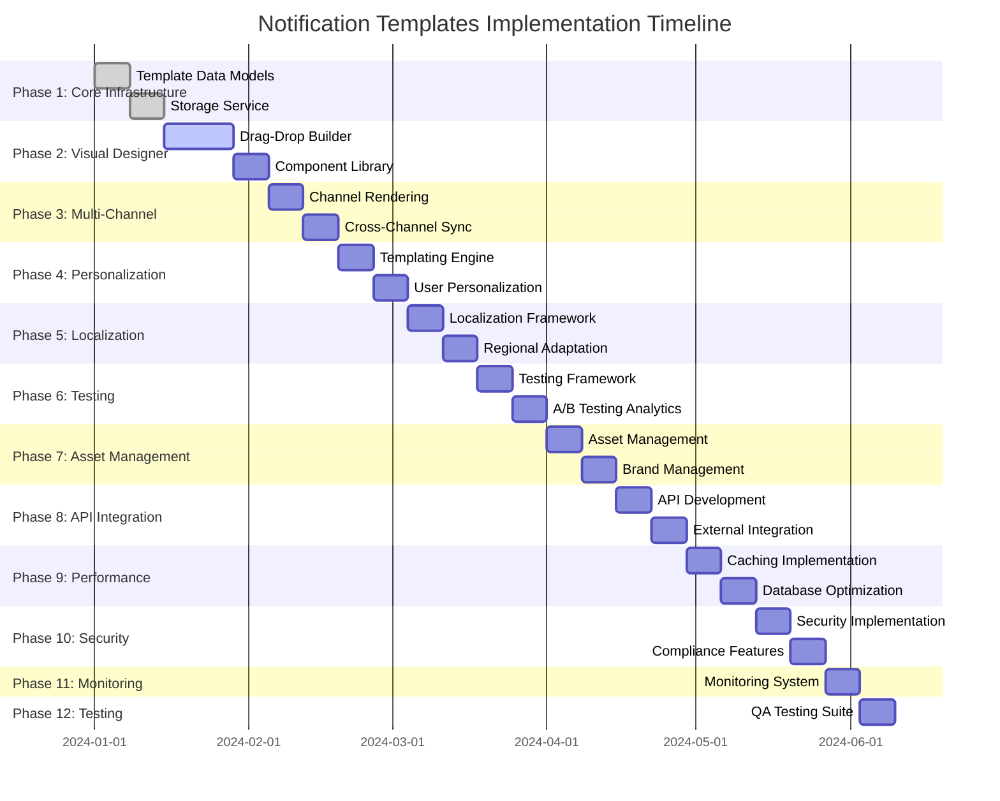

# Notification Templates - Implementation Tasks

## Project Overview

**Project:** Advanced Notification Templates System  
**Estimated Duration:** 22 weeks (220 hours)  
**Team Size:** 6-8 developers  
**Architecture:** Microservices with event-driven communication  

---

## Implementation Phases

### Phase 1: Core Template Infrastructure (Weeks 1-2)
**Duration:** 2 weeks (20 hours)  
**Priority:** Critical  
**Dependencies:** None  

#### Task 1.1: Template Data Models and Database Schema
- [ ] **Requirements:** R1.1, R1.3, R1.4  
- **Description:** Design and implement core template data models and PostgreSQL schema
- **Deliverables:**
  - Template, TemplateVersion, and TemplateComponent data models
  - PostgreSQL schema with proper indexing and constraints
  - Database migration scripts and seed data
  - Data validation and integrity checks
- **Acceptance Criteria:**
  - All template data models implemented with TypeScript interfaces
  - PostgreSQL schema supports template versioning and hierarchical organization
  - Database performance optimized with proper indexing
  - Data integrity constraints and validation rules in place
- **Estimated Time:** 8 hours

#### Task 1.2: Template Storage and Retrieval Service
- [ ] **Requirements:** R1.3, R6.1  
- **Description:** Implement template storage service with advanced search and organization
- **Deliverables:**
  - Template CRUD operations with validation
  - Advanced search functionality with full-text search
  - Template categorization and tagging system
  - Template metadata management
- **Acceptance Criteria:**
  - Template storage service supports all CRUD operations
  - Search functionality returns relevant results in <200ms
  - Template organization supports folders and categories
  - Metadata tracking for usage analytics
- **Estimated Time:** 12 hours

### Phase 2: Visual Template Designer (Weeks 3-5)
**Duration:** 3 weeks (30 hours)  
**Priority:** High  
**Dependencies:** Phase 1  

#### Task 2.1: Drag-and-Drop Template Builder
- [ ] **Requirements:** R1.1, R2.1  
- **Description:** Develop visual template designer with drag-and-drop functionality
- **Deliverables:**
  - React-based template designer interface
  - Drag-and-drop component library
  - Real-time template preview system
  - Template validation and error detection
- **Acceptance Criteria:**
  - Intuitive drag-and-drop interface for template creation
  - Real-time preview updates within 50ms
  - Component library with 20+ pre-built components
  - Template validation with clear error messages
- **Estimated Time:** 18 hours

#### Task 2.2: Template Component Library
- [ ] **Requirements:** R1.1, R5.2  
- **Description:** Create comprehensive library of reusable template components
- **Deliverables:**
  - Pre-built component library (headers, content blocks, CTAs, etc.)
  - Component customization interface
  - Brand-compliant component variations
  - Component usage analytics
- **Acceptance Criteria:**
  - 50+ pre-built components across all categories
  - Component customization supports brand guidelines
  - Component library searchable and well-organized
  - Usage tracking for component optimization
- **Estimated Time:** 12 hours

### Phase 3: Multi-Channel Template Support (Weeks 6-7)
**Duration:** 2 weeks (20 hours)  
**Priority:** High  
**Dependencies:** Phase 2  

#### Task 3.1: Channel-Specific Template Rendering
- [ ] **Requirements:** R1.2, R2.1  
- **Description:** Implement multi-channel template rendering with channel-specific optimizations
- **Deliverables:**
  - Email template rendering with HTML/CSS support
  - SMS template rendering with character optimization
  - Push notification template rendering
  - In-app message template rendering
- **Acceptance Criteria:**
  - All notification channels supported with native rendering
  - Channel-specific constraints and validation implemented
  - Template adaptation between channels functional
  - Rendering performance <100ms for simple templates
- **Estimated Time:** 15 hours

#### Task 3.2: Cross-Channel Template Consistency
- [ ] **Requirements:** R1.2, R5.2  
- **Description:** Ensure consistent branding and messaging across all channels
- **Deliverables:**
  - Cross-channel template synchronization
  - Brand consistency validation
  - Channel adaptation algorithms
  - Template preview for all channels
- **Acceptance Criteria:**
  - Templates maintain brand consistency across channels
  - Automatic adaptation preserves core message and branding
  - Preview system shows templates across all channels
  - Brand compliance scoring implemented
- **Estimated Time:** 5 hours

### Phase 4: Dynamic Content and Personalization (Weeks 8-9)
**Duration:** 2 weeks (20 hours)  
**Priority:** High  
**Dependencies:** Phase 3  

#### Task 4.1: Advanced Templating Engine
- [ ] **Requirements:** R2.1, R2.2  
- **Description:** Implement powerful templating engine with dynamic content capabilities
- **Deliverables:**
  - Handlebars.js/Liquid templating engine integration
  - Variable substitution with fallback values
  - Conditional content blocks and loops
  - Mathematical operations and string manipulation
- **Acceptance Criteria:**
  - Templating engine supports all required operations
  - Variable substitution works with complex data structures
  - Conditional logic and loops function correctly
  - Template compilation performance <1 second
- **Estimated Time:** 12 hours

#### Task 4.2: User Personalization System
- [ ] **Requirements:** R2.2, R2.3  
- **Description:** Implement deep personalization using user data and behavior
- **Deliverables:**
  - User profile data integration
  - Behavioral data utilization
  - Location-based personalization
  - Real-time content updates
- **Acceptance Criteria:**
  - Personalization uses comprehensive user data
  - Behavioral triggers update content dynamically
  - Location-based content works across regions
  - Real-time updates without template republishing
- **Estimated Time:** 8 hours

### Phase 5: Localization and Multi-Language Support (Weeks 10-11)
**Duration:** 2 weeks (20 hours)  
**Priority:** High  
**Dependencies:** Phase 4  

#### Task 5.1: Comprehensive Localization Framework
- [ ] **Requirements:** R3.1, R3.2  
- **Description:** Build complete localization system with translation management
- **Deliverables:**
  - Multi-language template creation interface
  - Translation workflow integration
  - Cultural adaptation beyond language
  - RTL language support
- **Acceptance Criteria:**
  - Templates support 10+ languages out of the box
  - Translation workflow integrates with professional services
  - Cultural adaptations include colors, imagery, and formats
  - RTL languages render correctly
- **Estimated Time:** 15 hours

#### Task 5.2: Regional Content Adaptation
- [ ] **Requirements:** R3.3  
- **Description:** Implement advanced regional content adaptation
- **Deliverables:**
  - Region-specific content variations
  - Legal compliance content adaptation
  - Market-specific customizations
  - Regional performance optimization
- **Acceptance Criteria:**
  - Content adapts to regional requirements automatically
  - Legal compliance variations implemented
  - Market-specific content and pricing supported
  - Regional optimization improves performance
- **Estimated Time:** 5 hours

### Phase 6: Template Testing and Optimization (Weeks 12-13)
**Duration:** 2 weeks (20 hours)  
**Priority:** High  
**Dependencies:** Phase 5  

#### Task 6.1: Comprehensive Template Testing Framework
- [ ] **Requirements:** R4.1  
- **Description:** Build extensive template testing capabilities
- **Deliverables:**
  - Multi-device rendering tests
  - Email client compatibility testing
  - Accessibility compliance testing
  - Performance and load time testing
- **Acceptance Criteria:**
  - Templates tested across 20+ devices and platforms
  - Email compatibility verified for major clients
  - Accessibility compliance (WCAG 2.1 AA) validated
  - Performance testing identifies optimization opportunities
- **Estimated Time:** 10 hours

#### Task 6.2: A/B Testing and Analytics Integration
- [ ] **Requirements:** R4.2, R4.3  
- **Description:** Implement A/B testing framework with analytics
- **Deliverables:**
  - Multi-variant testing system
  - Statistical significance calculation
  - Automated winner selection
  - Performance analytics dashboard
- **Acceptance Criteria:**
  - A/B testing supports up to 10 variants
  - Statistical analysis provides confidence levels
  - Automated winner selection based on significance
  - Analytics dashboard shows actionable insights
- **Estimated Time:** 10 hours

### Phase 7: Asset Management and Brand Control (Weeks 14-15)
**Duration:** 2 weeks (20 hours)  
**Priority:** Medium  
**Dependencies:** Phase 6  

#### Task 7.1: Digital Asset Management System
- [ ] **Requirements:** R5.1  
- **Description:** Build comprehensive digital asset management
- **Deliverables:**
  - Centralized asset library
  - Asset upload and processing
  - Image optimization and CDN integration
  - Asset usage tracking
- **Acceptance Criteria:**
  - Asset library supports 10TB+ storage
  - Automatic image optimization and format conversion
  - CDN integration for global delivery
  - Usage analytics for asset optimization
- **Estimated Time:** 12 hours

#### Task 7.2: Brand Management and Consistency
- [ ] **Requirements:** R5.2, R5.3  
- **Description:** Implement brand management and approval workflows
- **Deliverables:**
  - Brand guideline enforcement
  - Brand asset library
  - Content approval workflows
  - Brand compliance scoring
- **Acceptance Criteria:**
  - Brand guidelines automatically enforced
  - Approval workflows support multi-stage review
  - Brand compliance scoring provides actionable feedback
  - Brand consistency maintained across all templates
- **Estimated Time:** 8 hours

### Phase 8: API and Integration Framework (Weeks 16-17)
**Duration:** 2 weeks (20 hours)  
**Priority:** High  
**Dependencies:** Phase 7  

#### Task 8.1: Comprehensive API Development
- [ ] **Requirements:** R6.1, R6.3  
- **Description:** Build complete RESTful and GraphQL API framework
- **Deliverables:**
  - RESTful API for all template operations
  - GraphQL API for flexible querying
  - Webhook system for event notifications
  - API documentation and examples
- **Acceptance Criteria:**
  - APIs support all template management operations
  - GraphQL provides flexible data querying
  - Webhook system delivers real-time notifications
  - API documentation is comprehensive and up-to-date
- **Estimated Time:** 15 hours

#### Task 8.2: External System Integration
- [ ] **Requirements:** R6.2  
- **Description:** Implement integrations with external systems
- **Deliverables:**
  - CRM system integrations
  - Marketing automation platform connectors
  - Content management system integration
  - Design tool integrations
- **Acceptance Criteria:**
  - Major CRM platforms integrated (HubSpot, Salesforce)
  - Marketing automation platforms connected
  - CMS integration supports content synchronization
  - Design tools allow seamless import/export
- **Estimated Time:** 5 hours

### Phase 9: Performance Optimization and Caching (Weeks 18-19)
**Duration:** 2 weeks (20 hours)  
**Priority:** Medium  
**Dependencies:** Phase 8  

#### Task 9.1: Multi-Level Caching Implementation
- [ ] **Requirements:** NF1.1, NF1.2  
- **Description:** Implement comprehensive caching strategy
- **Deliverables:**
  - Multi-level caching (L1: Memory, L2: Redis, L3: Database)
  - Intelligent cache invalidation
  - Cache performance monitoring
  - Cache optimization algorithms
- **Acceptance Criteria:**
  - Template rendering improved by 80% with caching
  - Cache hit rates >90% for frequently accessed templates
  - Intelligent invalidation prevents stale data
  - Cache performance monitored and optimized
- **Estimated Time:** 12 hours

#### Task 9.2: Database and Query Optimization
- [ ] **Requirements:** NF1.1, NF1.2  
- **Description:** Optimize database performance and queries
- **Deliverables:**
  - Query optimization and indexing
  - Connection pooling implementation
  - Database partitioning strategy
  - Performance monitoring and alerting
- **Acceptance Criteria:**
  - Database queries optimized for <100ms response
  - Connection pooling handles 1000+ concurrent users
  - Database partitioning improves large dataset performance
  - Performance monitoring provides proactive alerts
- **Estimated Time:** 8 hours

### Phase 10: Security and Compliance (Weeks 20-21)
**Duration:** 2 weeks (20 hours)  
**Priority:** Critical  
**Dependencies:** Phase 9  

#### Task 10.1: Security Implementation
- [ ] **Requirements:** NF3.1  
- **Description:** Implement comprehensive security measures
- **Deliverables:**
  - Data encryption at rest and in transit
  - Authentication and authorization system
  - API security with OAuth 2.0 and JWT
  - Security monitoring and threat detection
- **Acceptance Criteria:**
  - All data encrypted with AES-256
  - Multi-factor authentication implemented
  - Role-based access control functional
  - Security monitoring detects and alerts on threats
- **Estimated Time:** 12 hours

#### Task 10.2: Compliance and Governance
- [ ] **Requirements:** NF3.2  
- **Description:** Ensure compliance with data protection regulations
- **Deliverables:**
  - GDPR compliance implementation
  - CCPA compliance features
  - Audit trail and logging system
  - Privacy by design features
- **Acceptance Criteria:**
  - GDPR compliance verified with legal review
  - CCPA features support user rights
  - Comprehensive audit trails maintained
  - Privacy protection built into all features
- **Estimated Time:** 8 hours

### Phase 11: Monitoring and Observability (Weeks 21-22)
**Duration:** 1 week (10 hours)  
**Priority:** Medium  
**Dependencies:** Phase 10  

#### Task 11.1: Comprehensive Monitoring System
- [ ] **Requirements:** System monitoring and alerting  
- **Description:** Implement complete monitoring and observability
- **Deliverables:**
  - Prometheus metrics collection
  - Grafana dashboards
  - Health monitoring system
  - Distributed tracing with Jaeger
- **Acceptance Criteria:**
  - All system metrics collected and visualized
  - Health monitoring provides real-time status
  - Distributed tracing tracks request flows
  - Alerting system notifies of issues proactively
- **Estimated Time:** 10 hours

### Phase 12: Testing and Quality Assurance (Weeks 22)
**Duration:** 1 week (10 hours)  
**Priority:** Critical  
**Dependencies:** Phase 11  

#### Task 12.1: Comprehensive Testing Suite
- [ ] **Requirements:** All functional requirements  
- **Description:** Implement complete testing framework
- **Deliverables:**
  - Unit tests with >90% coverage
  - Integration tests for all APIs
  - End-to-end tests for critical workflows
  - Performance and load testing
- **Acceptance Criteria:**
  - Unit test coverage >90% for all services
  - Integration tests cover all API endpoints
  - E2E tests validate complete user workflows
  - Performance tests validate scalability requirements
- **Estimated Time:** 10 hours

---

## Task Dependencies

---

## Resource Allocation

### Team Structure
- **Technical Lead:** 1 person (full-time)
- **Backend Developers:** 3 people (full-time)
- **Frontend Developers:** 2 people (full-time)
- **DevOps Engineer:** 1 person (part-time)
- **QA Engineer:** 1 person (part-time)

### Technology Stack
- **Backend:** Node.js, Express.js, TypeScript
- **Frontend:** React.js, TypeScript, Material-UI
- **Database:** PostgreSQL, MongoDB, Redis
- **Message Queue:** Apache Kafka
- **Search:** Elasticsearch
- **Monitoring:** Prometheus, Grafana, Jaeger
- **Infrastructure:** Docker, Kubernetes, AWS

---

## Risk Assessment

### High-Risk Items
1. **Template Rendering Performance:** Complex templates may exceed performance targets
   - **Mitigation:** Implement aggressive caching and template optimization
   - **Contingency:** Simplify template complexity if needed

2. **Multi-Channel Consistency:** Maintaining brand consistency across channels
   - **Mitigation:** Automated brand validation and testing
   - **Contingency:** Manual review process for critical templates

3. **Localization Complexity:** Cultural adaptation beyond translation
   - **Mitigation:** Partner with localization experts
   - **Contingency:** Focus on language translation first, cultural adaptation later

### Medium-Risk Items
1. **External Integration Reliability:** Third-party service dependencies
   - **Mitigation:** Circuit breakers and fallback mechanisms
   - **Contingency:** Graceful degradation when services unavailable

2. **Scalability Requirements:** Meeting performance targets under load
   - **Mitigation:** Horizontal scaling and load testing
   - **Contingency:** Vertical scaling as interim solution

---

## Success Criteria

### Technical Metrics
- **Template Rendering:** 95% of templates render in <100ms
- **System Availability:** 99.99% uptime achievement
- **API Performance:** 99% of API calls respond in <200ms
- **Template Throughput:** 1M+ template renders per hour
- **User Capacity:** Support 1,000+ concurrent users

### Business Metrics
- **Template Creation Efficiency:** 50%+ reduction in template creation time
- **Template Engagement:** 30%+ improvement in engagement rates
- **User Adoption:** 90%+ adoption of visual template designer
- **Template Reusability:** 70%+ template reuse rate
- **Customer Satisfaction:** 4.5+ out of 5 user satisfaction rating

### Quality Metrics
- **Code Coverage:** >90% unit test coverage
- **Bug Rate:** <1 critical bug per 1000 lines of code
- **Security Compliance:** 100% compliance with security requirements
- **Performance Regression:** Zero performance regressions in production
- **Documentation Coverage:** 100% API documentation coverage

---

## Deployment Strategy

### Environment Progression
1. **Development Environment:** Continuous integration and testing
2. **Staging Environment:** Pre-production testing and validation
3. **Production Environment:** Phased rollout with monitoring

### Rollout Plan
1. **Phase 1:** Internal testing with development team
2. **Phase 2:** Beta testing with select customers
3. **Phase 3:** Gradual rollout to 25% of users
4. **Phase 4:** Full production deployment

### Rollback Strategy
- **Automated rollback triggers:** Performance degradation or error rate increase
- **Manual rollback process:** Quick rollback to previous stable version
- **Data migration rollback:** Database rollback procedures for schema changes
- **Feature flags:** Ability to disable features without full rollback

This comprehensive task breakdown provides a clear roadmap for implementing the advanced notification templates system, ensuring all requirements are met while maintaining high quality and performance standards.