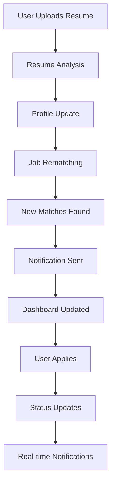

# Critical Integration Issues - Design

## Architecture Overview

The integration design follows a modular approach that connects existing systems while maintaining their independence. The solution focuses on creating unified user experiences through proper API integration, real-time communication, and consistent data flow.

### Current Architecture Analysis

```
Current State (❌ Disconnected):
┌─────────────────┐    ┌─────────────────┐    ┌─────────────────┐
│   Main App      │    │ Matching System │    │ Notification    │
│   (Next.js)      │    │ (Services Only) │    │ Service         │
│                 │    │                 │    │ (Standalone)    │
│ ✅ Auth          │❌   │ ✅ Core Logic   │❌   │ ✅ Channels      │
│ ✅ Jobs          │    │ ❌ No UI         │    │ ❌ No Integration│
│ ✅ Profiles      │    │ ❌ No API Routes │    │ ❌ No Triggers   │
│ ❌ AI Features   │    │                 │    │                 │
└─────────────────┘    └─────────────────┘    └─────────────────┘

Missing: Resume Builder UI, Real-time Events, Unified DB Schema
```

### Target Architecture

```
Target State (✅ Integrated):
┌─────────────────────────────────────────────────────────────┐
│                    Main Application (Next.js)                 │
├─────────────────────────────────────────────────────────────┤
│  ┌─────────────────┐  ┌─────────────────┐  ┌─────────────────┐ │
│  │   UI Layer      │  │  API Layer      │  │ Service Layer   │ │
│  │                 │  │                 │  │                 │ │
│  │ • Dashboard     │  │ • Matching API   │  │ • Matching Svc  │ │
│  │ • Resume Builder│  │ • Resume API     │  │ • Resume Svc    │ │
│  │ • Notifications │  │ • Notification   │  │ • Notification  │ │
│  │ • Job Listings  │  │   API            │  │   Integration   │ │
│  │ • Analytics     │  │ • Events API     │  │ • Event Bus     │ │
│  └─────────────────┘  └─────────────────┘  └─────────────────┘ │
├─────────────────────────────────────────────────────────────┤
│  ┌─────────────────┐  ┌─────────────────┐  ┌─────────────────┐ │
│  │   Data Layer    │  │ Integration     │  │ External        │ │
│  │                 │  │ Layer           │  │ Services        │ │
│  │ • Unified DB    │  │ • Event Bus     │  │ • OpenAI        │ │
│  │ • Cache Layer   │  │ • WebSocket     │  │ • Email/SMS     │ │
│  │ • File Storage  │  │ • Message Queue │  │ • Analytics     │ │
│  │ • Search Index  │  │ • Background    │  │                 │ │
│  │                 │  │   Processing    │  │                 │ │
│  └─────────────────┘  └─────────────────┘  └─────────────────┘ │
└─────────────────────────────────────────────────────────────┘
```

## Component Design

### 1. Unified API Gateway

**Location:** `src/app/api/` (Next.js App Router)

```typescript
// API Route Structure
src/app/api/
├── matching/
│   ├── find-matches/route.ts
│   ├── recommendations/
│   │   ├── jobs/[candidateId]/route.ts
│   │   └── candidates/[jobId]/route.ts
│   └── analytics/route.ts
├── resume-builder/
│   ├── upload/route.ts
│   ├── analyze/route.ts
│   ├── generate/route.ts
│   └── templates/route.ts
├── notifications/
│   ├── preferences/route.ts
│   ├── history/route.ts
│   └── mark-read/route.ts
└── events/
    ├── publish/route.ts
    └── subscribe/route.ts
```

### 2. Enhanced Database Schema

**Location:** `prisma/schema.prisma`

```prisma
// Enhanced Candidate Profile
model CandidateProfile {
  id              String    @id @default(cuid())
  userId          String    @unique
  personalInfo    Json
  professionalSummary String?
  skills          Skill[]
  experience      WorkExperience[]
  education       Education[]
  certifications  Certification[]
  preferences     Json
  resumeFiles     ResumeFile[]
  matchResults    MatchResult[]
  completionScore Int       @default(0)
  visibility      String    @default("public")
  isActive        Boolean   @default(true)
  embedding       Float[]   // For AI matching
  metadata        Json
  createdAt       DateTime  @default(now())
  updatedAt       DateTime  @updatedAt

  user            User      @relation(fields: [userId], references: [id])
}

// Enhanced Job Profile
model JobProfile {
  id              String    @id @default(cuid())
  employerId      String
  title           String
  description     String
  requirements    Json
  preferences     Json
  compensation    Json
  companyInfo     Json
  matchResults    MatchResult[]
  embedding       Float[]   // For AI matching
  postedDate      DateTime  @default(now())
  expiryDate      DateTime?
  urgency         String    @default("medium")
  isActive        Boolean   @default(true)
  metadata        Json
  createdAt       DateTime  @default(now())
  updatedAt       DateTime  @updatedAt

  employer        User      @relation(fields: [employerId], references: [id])
}

// Match Results
model MatchResult {
  id            String   @id @default(cuid())
  candidateId   String
  jobId         String
  score         Float
  breakdown     Json
  explanation   Json
  confidence    Float
  status        String   @default("new")
  feedback      Json?
  matchDate     DateTime @default(now())
  algorithm     String
  recommendations String[]
  metadata      Json

  candidate     CandidateProfile @relation(fields: [candidateId], references: [id])
  job           JobProfile       @relation(fields: [jobId], references: [id])

  @@unique([candidateId, jobId])
}

// Resume Files
model ResumeFile {
  id          String   @id @default(cuid())
  profileId   String
  fileName    String
  fileUrl     String
  fileSize    Int
  fileType    String
  analysis    Json?    // AI analysis results
  atsScore    Float?
  isPrimary   Boolean  @default(false)
  status      String   @default("processing")
  createdAt   DateTime @default(now())
  updatedAt   DateTime @updatedAt

  profile     CandidateProfile @relation(fields: [profileId], references: [id])
}

// Notification Records
model Notification {
  id          String   @id @default(cuid())
  userId      String
  type        String
  title       String
  content     String
  channels    Json
  status      String   @default("pending")
  sentAt      DateTime?
  readAt      DateTime?
  metadata    Json
  createdAt   DateTime @default(now())

  user        User     @relation(fields: [userId], references: [id])
}
```

### 3. Event Bus System

**Location:** `src/lib/events/event-bus.ts`

```typescript
interface Event {
  id: string;
  type: string;
  data: any;
  timestamp: Date;
  userId?: string;
  metadata?: any;
}

interface EventHandler {
  eventType: string;
  handler: (event: Event) => Promise<void>;
  priority: number;
}

class EventBus {
  private handlers: Map<string, EventHandler[]> = new Map();
  private queue: Event[] = [];
  private processing = false;

  async publish(event: Event): Promise<void>;
  async subscribe(eventType: string, handler: EventHandler): Promise<void>;
  async unsubscribe(eventType: string, handlerId: string): Promise<void>;
  private async processEvents(): Promise<void>;
}

// Event Types
export const EVENT_TYPES = {
  // Resume Events
  RESUME_UPLOADED: 'resume.uploaded',
  RESUME_ANALYZED: 'resume.analyzed',
  RESUME_UPDATED: 'resume.updated',

  // Matching Events
  JOB_MATCH_FOUND: 'job.match_found',
  CANDIDATE_MATCH_FOUND: 'candidate.match_found',
  MATCH_SCORE_UPDATED: 'match.score_updated',

  // Application Events
  APPLICATION_SUBMITTED: 'application.submitted',
  APPLICATION_STATUS_CHANGED: 'application.status_changed',

  // User Events
  PROFILE_UPDATED: 'user.profile_updated',
  PREFERENCES_CHANGED: 'user.preferences_changed',

  // System Events
  JOB_POSTED: 'job.posted',
  JOB_UPDATED: 'job.updated',
  NOTIFICATION_SENT: 'notification.sent'
};
```

### 4. Real-time Integration

**Location:** `src/lib/websocket/integration.ts`

```typescript
import { Server as SocketIOServer } from 'socket.io';
import { EventBus } from '../events/event-bus';

class WebSocketIntegration {
  private io: SocketIOServer;
  private eventBus: EventBus;

  constructor(io: SocketIOServer, eventBus: EventBus) {
    this.io = io;
    this.eventBus = eventBus;
    this.setupEventHandlers();
  }

  private setupEventHandlers(): void {
    // Handle new job matches
    this.eventBus.subscribe(EVENT_TYPES.JOB_MATCH_FOUND, {
      eventType: EVENT_TYPES.JOB_MATCH_FOUND,
      handler: async (event) => {
        this.io.to(`user:${event.userId}`).emit('job_match', event.data);
      },
      priority: 1
    });

    // Handle application status changes
    this.eventBus.subscribe(EVENT_TYPES.APPLICATION_STATUS_CHANGED, {
      eventType: EVENT_TYPES.APPLICATION_STATUS_CHANGED,
      handler: async (event) => {
        this.io.to(`user:${event.userId}`).emit('application_update', event.data);
      },
      priority: 1
    });

    // Handle resume analysis completion
    this.eventBus.subscribe(EVENT_TYPES.RESUME_ANALYZED, {
      eventType: EVENT_TYPES.RESUME_ANALYZED,
      handler: async (event) => {
        this.io.to(`user:${event.userId}`).emit('resume_ready', event.data);
      },
      priority: 1
    });
  }

  // Handle user connections
  handleConnection(socket: any): void {
    const userId = socket.userId;
    socket.join(`user:${userId}`);

    // Send initial data
    this.sendInitialData(socket, userId);

    // Handle user actions
    socket.on('mark_notification_read', (notificationId) => {
      this.handleNotificationRead(userId, notificationId);
    });

    socket.on('save_job_recommendation', (jobId) => {
      this.handleSaveJob(userId, jobId);
    });
  }
}
```

### 5. Notification Integration Service

**Location:** `src/services/notifications/integration-service.ts`

```typescript
class NotificationIntegrationService {
  private eventBus: EventBus;
  private notificationChannels: Map<string, NotificationChannel>;

  constructor(eventBus: EventBus) {
    this.eventBus = eventBus;
    this.setupEventListeners();
  }

  private setupEventListeners(): void {
    // Job match notifications
    this.eventBus.subscribe(EVENT_TYPES.JOB_MATCH_FOUND, {
      eventType: EVENT_TYPES.JOB_MATCH_FOUND,
      handler: async (event) => {
        await this.sendJobMatchNotification(event);
      },
      priority: 2
    });

    // Application status notifications
    this.eventBus.subscribe(EVENT_TYPES.APPLICATION_STATUS_CHANGED, {
      eventType: EVENT_TYPES.APPLICATION_STATUS_CHANGED,
      handler: async (event) => {
        await this.sendApplicationStatusNotification(event);
      },
      priority: 1
    });

    // Resume analysis notifications
    this.eventBus.subscribe(EVENT_TYPES.RESUME_ANALYZED, {
      eventType: EVENT_TYPES.RESUME_ANALYZED,
      handler: async (event) => {
        await this.sendResumeAnalysisNotification(event);
      },
      priority: 2
    });
  }

  private async sendJobMatchNotification(event: Event): Promise<void> {
    const { userId, data: { job, matchScore } } = event;

    await this.sendNotification({
      userId,
      type: 'job_match',
      title: 'New Job Match!',
      content: `We found a job that matches your profile with ${matchScore}% compatibility.`,
      channels: ['in_app', 'email'],
      metadata: { jobId: job.id, matchScore }
    });
  }
}
```

### 6. Resume Builder Integration

**Location:** `src/services/resume-builder/integration.ts`

```typescript
class ResumeBuilderIntegration {
  private eventBus: EventBus;
  private matchingService: MatchingCoreService;

  constructor(eventBus: EventBus, matchingService: MatchingCoreService) {
    this.eventBus = eventBus;
    this.matchingService = matchingService;
  }

  async processResumeUpload(userId: string, file: File): Promise<ResumeAnalysis> {
    // Parse and analyze resume
    const analysis = await this.parseAndAnalyzeResume(file);

    // Update candidate profile
    await this.updateCandidateProfile(userId, analysis);

    // Trigger job re-matching
    await this.triggerJobRematching(userId);

    // Publish events
    await this.eventBus.publish({
      id: generateId(),
      type: EVENT_TYPES.RESUME_UPLOADED,
      data: { userId, analysis },
      timestamp: new Date(),
      userId
    });

    return analysis;
  }

  private async triggerJobRematching(userId: string): Promise<void> {
    // Find new job matches based on updated profile
    const matches = await this.matchingService.findJobsForCandidate(userId);

    // Publish match events
    for (const match of matches.data) {
      await this.eventBus.publish({
        id: generateId(),
        type: EVENT_TYPES.JOB_MATCH_FOUND,
        data: { userId, job: match.profile, matchScore: match.matchScore },
        timestamp: new Date(),
        userId
      });
    }
  }
}
```

## User Interface Integration

### 1. Enhanced Candidate Dashboard

**Location:** `src/app/dashboard/page.tsx`

```typescript
// Dashboard Components
├── components/
│   ├── job-recommendations.tsx      // AI-powered job suggestions
│   ├── resume-status.tsx            // Resume analysis and ATS score
│   ├── application-tracker.tsx      // Real-time application status
│   ├── notifications-panel.tsx      // In-app notifications
│   └── skill-gap-analysis.tsx      // Skill improvement suggestions
├── hooks/
│   ├── useJobRecommendations.ts     // Real-time job recommendations
│   ├── useNotifications.ts          // Notification management
│   └── useRealTimeUpdates.ts        // WebSocket integration
└── actions/
    ├── dashboard-actions.ts         // Dashboard API calls
    └── notification-actions.ts      // Notification actions
```

### 2. Resume Builder UI

**Location:** `src/components/resume-builder/`

```typescript
// Resume Builder Components
├── upload-zone.tsx                  // Drag-and-drop file upload
├── analysis-results.tsx            // AI analysis display
├── template-selector.tsx           // Resume template selection
├── editor.tsx                      // Interactive resume editor
├── ats-optimizer.tsx              // ATS optimization tools
└── preview.tsx                     // Resume preview and download

// API Integration
├── hooks/useResumeBuilder.ts       // Resume builder state management
└── services/resume-service.ts      // API integration
```

### 3. Matching Interface

**Location:** `src/components/matching/`

```typescript
// Matching Components
├── job-recommendations.tsx          // Personalized job suggestions
├── match-details.tsx               // Detailed match explanations
├── candidate-suggestions.tsx       // For employer dashboard
├── match-filters.tsx               // Recommendation filtering
└── match-analytics.tsx             // Matching insights

// Real-time Features
├── hooks/useRealTimeMatches.ts     // Live match updates
└── services/matching-service.ts    // Matching API integration
```

## Integration Flow Architecture

### 1. User Journey Integration



### 2. Data Flow Integration

```typescript
// Unified Data Flow
class DataFlowOrchestrator {
  async handleResumeUpload(userId: string, file: File): Promise<void> {
    // 1. Process resume
    const analysis = await this.resumeService.analyze(file);

    // 2. Update profile
    await this.profileService.updateFromResume(userId, analysis);

    // 3. Trigger re-matching
    const matches = await this.matchingService.findJobsForCandidate(userId);

    // 4. Send notifications
    await this.notificationService.sendJobMatches(userId, matches);

    // 5. Update UI via WebSocket
    await this.websocketService.updateDashboard(userId, { matches, analysis });
  }
}
```

## Performance Optimization

### 1. Caching Strategy

```typescript
// Multi-level Caching
class IntegrationCache {
  private redis: Redis;
  private memoryCache: Map<string, any>;

  async getCachedMatches(userId: string): Promise<MatchResult[] | null> {
    const cacheKey = `matches:${userId}`;

    // Check memory cache first
    const memoryResult = this.memoryCache.get(cacheKey);
    if (memoryResult) return memoryResult;

    // Check Redis cache
    const redisResult = await this.redis.get(cacheKey);
    if (redisResult) {
      const parsed = JSON.parse(redisResult);
      this.memoryCache.set(cacheKey, parsed);
      return parsed;
    }

    return null;
  }
}
```

### 2. Background Processing

```typescript
// Queue-based Background Tasks
class BackgroundTaskQueue {
  async scheduleJobRematching(userId: string): Promise<void> {
    await this.queue.add('job-rematching', { userId }, {
      delay: 1000, // 1 second delay
      attempts: 3,
      backoff: 'exponential'
    });
  }

  async scheduleNotificationDelivery(notificationId: string): Promise<void> {
    await this.queue.add('notification-delivery', { notificationId }, {
      priority: 1,
      delay: 0,
      attempts: 5
    });
  }
}
```

## Security Integration

### 1. API Security

```typescript
// Unified API Security Middleware
class APISecurityMiddleware {
  async validateRequest(req: Request): Promise<boolean> {
    // 1. Authentication check
    const user = await this.authenticate(req);
    if (!user) return false;

    // 2. Authorization check
    if (!await this.authorize(user, req.url, req.method)) return false;

    // 3. Rate limiting
    if (!await this.checkRateLimit(user.id)) return false;

    // 4. Request validation
    if (!this.validateRequestData(req)) return false;

    return true;
  }
}
```

### 2. File Upload Security

```typescript
// Secure File Processing
class SecureFileProcessor {
  async processResumeUpload(file: File, userId: string): Promise<ProcessedFile> {
    // 1. File validation
    await this.validateFile(file);

    // 2. Virus scanning
    await this.scanForViruses(file);

    // 3. Content analysis
    const analysis = await this.analyzeContent(file);

    // 4. Secure storage
    const storedFile = await this.storeSecurely(file, userId);

    return { file: storedFile, analysis };
  }
}
```

## Monitoring and Observability

### 1. Integration Metrics

```typescript
// Integration Monitoring
class IntegrationMonitor {
  async trackIntegrationEvent(event: string, metadata: any): Promise<void> {
    await this.metricsCollector.record(event, {
      timestamp: new Date(),
      ...metadata
    });
  }

  async getIntegrationHealth(): Promise<IntegrationHealth> {
    return {
      matchingSystem: await this.checkMatchingHealth(),
      notificationSystem: await this.checkNotificationHealth(),
      resumeBuilder: await this.checkResumeBuilderHealth(),
      realTimeFeatures: await this.checkWebSocketHealth()
    };
  }
}
```

## Deployment Architecture

### 1. Container Strategy

```yaml
# docker-compose.integration.yml
version: '3.8'
services:
  app:
    build: .
    environment:
      - NODE_ENV=production
      - DATABASE_URL=postgresql://...
      - REDIS_URL=redis://redis:6379
    depends_on:
      - postgres
      - redis
    volumes:
      - ./uploads:/app/uploads
    ports:
      - "3000:3000"

  postgres:
    image: postgres:15
    environment:
      POSTGRES_DB: jobfinders_integrated
    volumes:
      - postgres_data:/var/lib/postgresql/data

  redis:
    image: redis:7-alpine
    volumes:
      - redis_data:/data

volumes:
  postgres_data:
  redis_data:
```

This design provides a comprehensive integration solution that connects all existing systems while maintaining their independence and adding the necessary UI components and real-time features for a cohesive user experience.