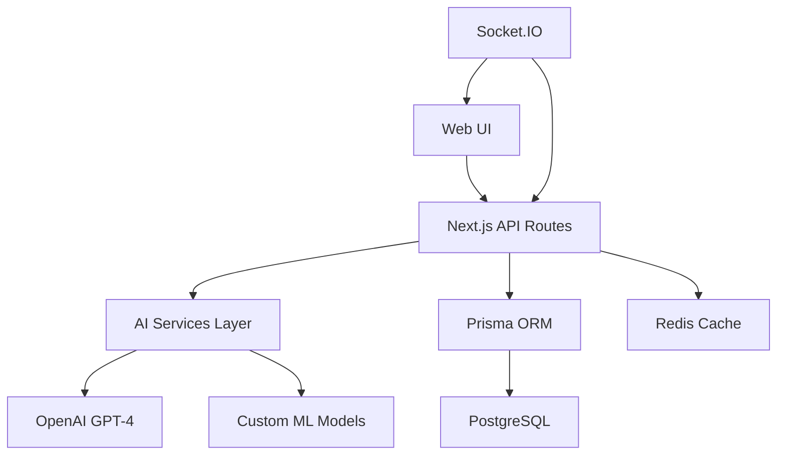
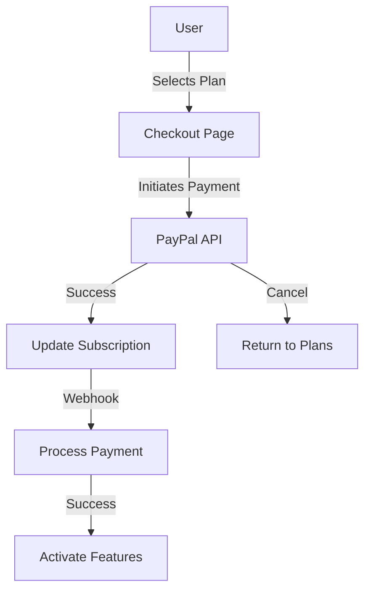

# 💼 JobFinders – Modern AI-Powered Job Board Platform

A production-ready, full-stack job board platform built with Next.js, TypeScript, Prisma, and AI capabilities. Designed for both job seekers and employers with advanced AI features, real-time interactions, and a beautiful, responsive UI.

---

## 🚀 Technology Stack

### Core Framework & Language
- **Next.js 15** – App Router, server components, and optimized routing
- **TypeScript 5** – Type-safe development for reliability and maintainability

### AI & Machine Learning
- **OpenAI GPT-4** – Natural language processing and generation
- **TensorFlow.js** – Client-side ML processing
- **Custom ML Models** – Specialized matching and analysis
- **Redis** – AI response caching and performance optimization

### Styling & UI
- **Tailwind CSS 4** – Utility-first CSS for rapid, responsive design
- **shadcn/ui** – Accessible, customizable UI components
- **Lucide React** – Modern icon system

### Forms & Validation
- **React Hook Form** – Performant, scalable forms
- **Zod** – TypeScript-first schema validation

### State & Data Management
- **Zustand** – Simple, scalable state management
- **TanStack Query** – Powerful data fetching and caching
- **Axios** – Promise-based HTTP client

### Backend & Database
- **Prisma ORM** – Type-safe database access (PostgreSQL, MySQL, etc.)
- **NextAuth.js** – Secure authentication with custom roles (seeker, employer, admin)
- **Socket.IO** – Real-time features (notifications, chat)

### Advanced Features
- **TanStack Table** – Headless, flexible data tables
- **DND Kit** – Modern drag-and-drop for React
- **Recharts** – Data visualization and charts
- **Sharp** – High-performance image processing

### Utilities & Internationalization
- **Next Intl** – Internationalization for multi-language support
- **Date-fns** – Modern date utilities
- **ReactUse** – Essential React hooks

---

## ✨ Key Features

### AI-Powered Features
1. **Smart Resume Builder**
   - AI-assisted content generation
   - ATS optimization suggestions
   - Industry-specific formatting
   - Skill gap analysis

2. **Intelligent ATS System**
   - Advanced keyword extraction
   - Resume scoring algorithm
   - Industry-specific term matching
   - Compliance verification

3. **AI Candidate Matching**
   - Skills-based intelligent matching
   - Experience level analysis
   - Cultural fit assessment
   - Career path recommendations

4. **AI Employment Agents**
   - Smart job recommendations
   - Interview preparation assistant
   - Career guidance
   - Salary negotiation support

5. **Context-Aware Notifications**
   - Smart timing system
   - Multi-channel delivery
   - Engagement optimization
   - Personalized alerts

### Traditional Features
- Job posting and management
- Application tracking
- Real-time chat
- Profile management
- Advanced search
- Analytics dashboard

---

## 🏗️ Project Structure

```
src/
├── app/           # Next.js App Router pages & API routes
├── components/    # Reusable React components
│   └── ui/       # shadcn/ui components
├── ai/           # AI service integrations
│   ├── resume/   # Resume builder services
│   ├── ats/      # ATS system
│   ├── matching/ # Candidate matching
│   └── agents/   # AI agents
├── hooks/        # Custom React hooks
└── lib/          # Utilities and configurations
prisma/
└── schema.prisma  # Database schema
docs/
└── ...            # TODO files and context documentation
```

---

## ⚡ Quick Start

```bash
# Install dependencies
npm install

# Start development server
npm run dev

# Build for production
npm run build

# Start production server
npm start
```

Visit [http://localhost:3000](http://localhost:3000) to view the app.

---

## 🗄️ Database & Auth

- **Prisma**: Edit `prisma/schema.prisma` for models.  
  Run migrations with:
  ```bash
  npx prisma migrate dev
  ```
- **NextAuth.js**: Configured for role-based authentication (seeker, employer, admin).

---

## 🛠️ Development Notes

- **Aliases**:  
  - `@/components` → `src/components`  
  - `@/lib` → `src/lib`  
  - `@/hooks` → `src/hooks`  
  - `@/components/ui` → `src/components/ui`
- **Custom Server**:  
  - `server.ts` integrates Next.js and Socket.IO for real-time features.

---

## 📚 Documentation

Detailed documentation can be found in the [`docs/`](./docs) directory:
- Architecture Overview
- AI Features Implementation
- Development Guidelines
- API Documentation
- TODO Lists

---

## 🔄 AI Architecture



---

## 🤝 Contributing

1. Fork the repo and clone it
2. Create a new branch for your feature or fix
3. Commit your changes and open a pull request

---

## 💰 Subscriptions & Plans

### Payment Processing
- **PayPal API Integration** for secure payment processing
- Webhook handling for payment events
- Automatic renewal management
- Invoice generation

### Available Plans

#### Job Seekers
1. **Free Plan**
   - Basic job search
   - Limited job applications (5/month)
   - Basic profile
   - AI resume review (1/month)

2. **Premium Plan** ($9.99/month)
   - Unlimited job applications
   - Enhanced profile visibility
   - AI resume builder & reviews
   - Priority support
   - Interview preparation tools

3. **Professional Plan** ($19.99/month)
   - All Premium features
   - AI career coach access
   - Salary insights
   - Direct messaging to employers
   - Custom job alerts

#### Employers
1. **Starter Plan** ($49/month)
   - Up to 5 job postings
   - Basic candidate search
   - Standard job visibility
   - Basic analytics

2. **Business Plan** ($99/month)
   - Up to 15 job postings
   - AI-powered candidate matching
   - Featured job listings
   - Advanced analytics
   - Bulk resume download

3. **Enterprise Plan** ($199/month)
   - Unlimited job postings
   - Priority support
   - Custom branding
   - API access
   - Dedicated account manager

### Implementation Details
```typescript
interface SubscriptionPlan {
  id: string;
  name: string;
  price: number;
  interval: 'month' | 'year';
  features: string[];
  limits: {
    jobPostings?: number;
    applications?: number;
    aiCredits?: number;
  };
}

interface PaymentProcessor {
  provider: 'paypal';
  mode: 'sandbox' | 'live';
  webhookUrl: string;
  successUrl: string;
  cancelUrl: string;
}
```

### Payment Flow


---

Built with ❤️ using Next.js, Prisma, and shadcn/ui.
