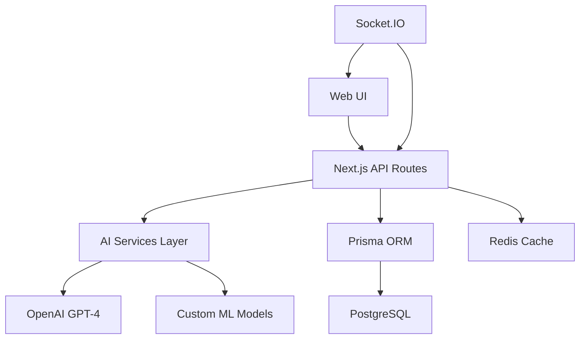

# AI Architecture Overview

## System Components

## Data Flow
1. User Input → API Routes
2. API Routes → AI Services
3. AI Processing → Database
4. Real-time Updates → Socket.IO
5. Response → User Interface

## AI Service Integration
- OpenAI API for natural language tasks
- TensorFlow.js for client-side processing
- Custom ML models for specific features
- Redis for caching AI responses