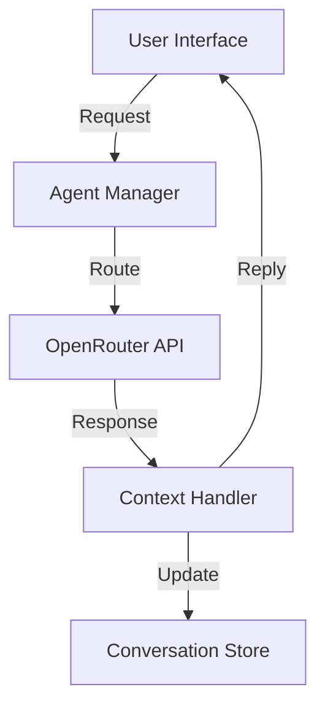

# AI Agents System Design

## Architecture


## Models Selection
1. Primary: claude-2
   - Complex reasoning
   - Long context windows
   - Career guidance

2. Secondary: gpt-3.5-turbo
   - Quick responses
   - Basic Q&A
   - Cost-effective

## API Implementation
```typescript
interface AgentConfig {
    type: 'career' | 'interview' | 'resume' | 'salary';
    model: 'claude-2' | 'gpt-3.5-turbo';
    context: ConversationContext;
    temperature: number;
}
```