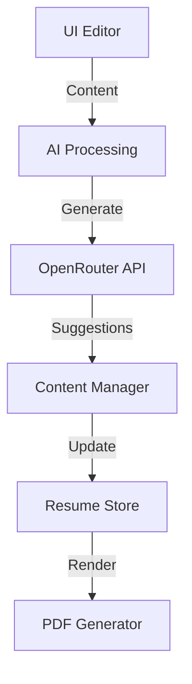

# Resume Builder Design

## Architecture


## Database Schema
```prisma
model Resume {
    id          String   @id @default(cuid())
    userId      String
    title       String
    content     Json
    template    String
    version     Int      @default(1)
    createdAt   DateTime @default(now())
    updatedAt   DateTime @updatedAt
    atsScore    Float?
    status      ResumeStatus
}

enum ResumeStatus {
    DRAFT
    PUBLISHED
    ARCHIVED
}
```

## API Routes
```typescript
// Resume Builder API Routes
interface ResumeAPI {
    '/api/resume/create': RouteConfig;
    '/api/resume/update': RouteConfig;
    '/api/resume/analyze': RouteConfig;
    '/api/resume/export': RouteConfig;
}
```