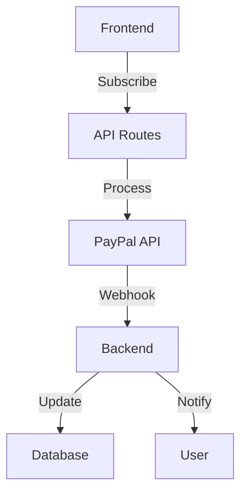

# Subscription System Design

## Architecture


## Database Schema
```prisma
model Subscription {
    id        String   @id @default(cuid())
    userId    String
    planId    String
    status    SubscriptionStatus
    startDate DateTime
    endDate   DateTime
    paypalId  String?
    features  Json
    metadata  Json?
}

enum SubscriptionStatus {
    ACTIVE
    CANCELLED
    PAST_DUE
    PENDING
}
```

## API Routes
- `/api/subscriptions/create`
- `/api/subscriptions/cancel`
- `/api/subscriptions/upgrade`
- `/api/subscriptions/webhook`

## Components
- SubscriptionCard
- PaymentForm
- PlanComparison
- BillingHistory